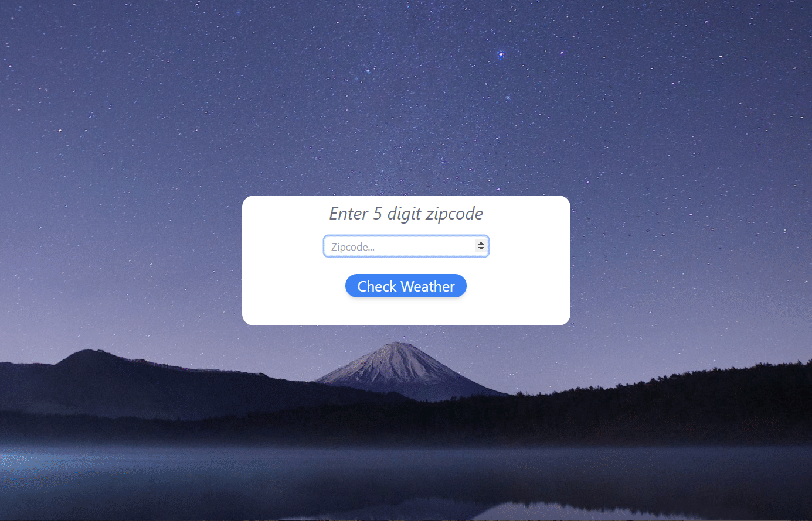

# React Weather App

### Table of Contents

- [Description](#description)
- [Demo](#demo)
- [License](#license)
- [Author Info](#author-info)

---

## Description

This is just a standard weather app that takes a 5 digit US zip code and retrieves the corresponding data upon user request. Users are then presented with the current forecast for the location and also given the option for a 5 day extended forecast.  It was built using React on the frontend and uses an Express.js server on the backend for completing the API requests. 

## Technology/Tools Used

- React
- JavaScript
- Tailwind CSS
- Node.js
- Express.js
- Heroku

## API

- [OpenWeatherMap](https://openweathermap.org/)

## Inspiration 

The main reason I decided to build this project was to simply practice working with React. I understood the fundamentals of React when I started this, but by the end, I had learned so much more than any tutorial would have taught me. Every day I was getting stuck on a new problem and just figured it out as I went. The progress was somewhat addicting and before I knew it I found myself waking up each day excited to get on my computer and solve the next issue. This was definetely my favorite project to build so far. 

## URL

The app is currently hosted on a Heroku server and will take some time to load but should not take more than a minute to start up. 

https://react-weather-v2.herokuapp.com/
---
# Demo

 - [Back To The Top](#react-weather-app)

 ## License 

 MIT License 

 Copyright 2021 Jake Januszanis

Permission is hereby granted, free of charge, to any person obtaining a copy of this software and associated documentation files (the "Software"), to deal in the Software without restriction, including without limitation the rights to use, copy, modify, merge, publish, distribute, sublicense, and/or sell copies of the Software, and to permit persons to whom the Software is furnished to do so, subject to the following conditions:

The above copyright notice and this permission notice shall be included in all copies or substantial portions of the Software.

THE SOFTWARE IS PROVIDED "AS IS", WITHOUT WARRANTY OF ANY KIND, EXPRESS OR IMPLIED, INCLUDING BUT NOT LIMITED TO THE WARRANTIES OF MERCHANTABILITY, FITNESS FOR A PARTICULAR PURPOSE AND NONINFRINGEMENT. IN NO EVENT SHALL THE AUTHORS OR COPYRIGHT HOLDERS BE LIABLE FOR ANY CLAIM, DAMAGES OR OTHER LIABILITY, WHETHER IN AN ACTION OF CONTRACT, TORT OR OTHERWISE, ARISING FROM, OUT OF OR IN CONNECTION WITH THE SOFTWARE OR THE USE OR OTHER DEALINGS IN THE SOFTWARE.

[Back To The Top](#react-weather-app)

---

## Author Info 

- Website - [Jake Januszanis](http://jakejanuszanis.com)
- Linkedin - [@jakejanuszanis](https://www.linkedin.com/in/jake-januszanis/)

[Back To The Top](#react-weather-app)
